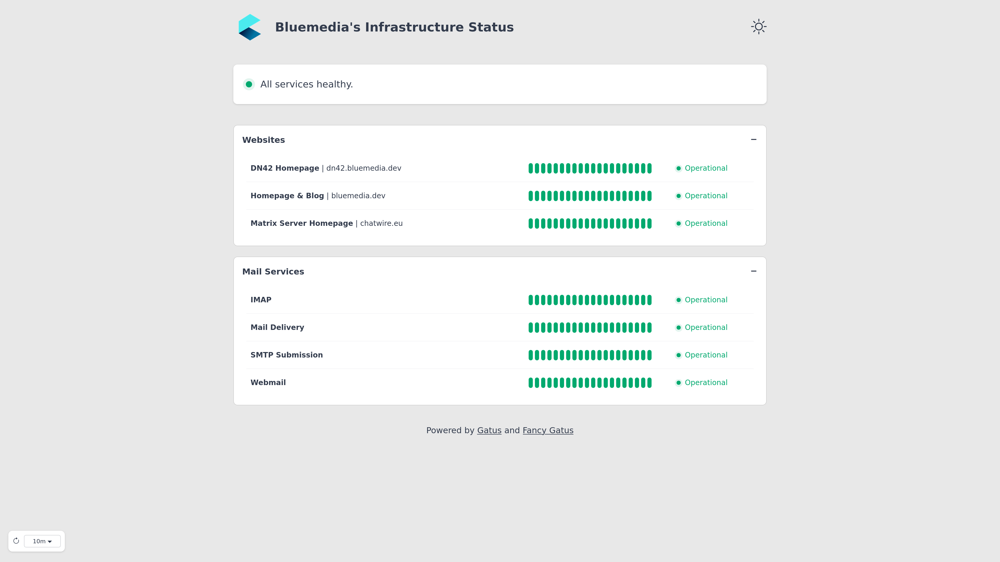
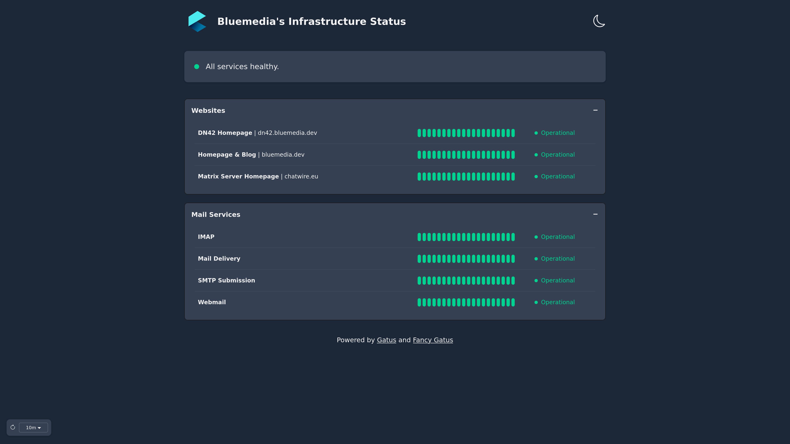

# Fancy Gatus

Fancy Gatus is an alternative frontend for the monitoring tool [Gatus](https://github.com/TwiN/gatus). The goal is to provide a simplified and modern status page based on data from a Gatus instance, which only displays the most important information in a way that is understandable for end users.

You can see it in action [here](https://status.bluemedia.dev) or check out the screenshots below:

<details>
<summary>Screenshots</summary>





</details>

## Configuration

The frontend tries to retrieve a configuration file named `config.json` from the webroot during page load. If the configuration is loaded successfully, it will be used to adjust the frontend. The possible options are listed below.

| Parameter                | Description                                                                                                                                                                                                                                                              | Default                 |
| :----------------------- | :----------------------------------------------------------------------------------------------------------------------------------------------------------------------------------------------------------------------------------------------------------------------- | :---------------------- |
| `title`                  | Title of the page. Both in the tab and next to the logo.                                                                                                                                                                                                                 | `Infrastructure Status` |
| `gatusBaseUrl`           | Alternative base URL of the Gatus instance, if the API is not available relative to the frontend.                                                                                                                                                                        | `none`                  |
| `hiddenGroups`           | Array containing names of groups that should be hidden. These groups are still visible in the API response!                                                                                                                                                              | `[]`                    |
| `hiddenStatuses`         | Array containing names of statuses that should be hidden. These are still visible in the API response!                                                                                                                                                                   | `[]`                    |
| `groupOrder`             | Array containing names of groups. The groups are sorted in the frontend according to the order in the array (different from alphabetical sorting by default). If groups are not included in the array, they will be added alphabetically sorted below the sorted groups. | `[]`                    |
| `defaultExpandGroups`    | Boolean specifying if groups should be expanded by default.                                                                                                                                                                                                              | `false`                 |
| `defaultRefreshInterval` | Interval in seconds after which the API data and config is refreshed in the background by default. Can be changed by the user by selecting a value in the lower left corner of the page. Possible values: `10`, `30`, `60`, `120`, `300`, `600`                          | `60`                    |
| `notice`                 | Optional configuration for a notice on the page. It can be used to provide further information about a current outage, for example.                                                                                                                                      | `{}`                    |
| `notice.type`            | Type of the notice. This determines the background color of the card. Possible values: `success`, `warning`, `error`, not defined (same color as other cards)                                                                                                            | not defined             |
| `notice.title`           | Title of the notice card.                                                                                                                                                                                                                                                | `""`                    |
| `notice.content`         | Content text of the notice card.                                                                                                                                                                                                                                         | `""`                    |
| `notice.createdAt`       | Date and time the notice was created at. For example, use the format `yyyy-MM-dd hh:mm`                                                                                                                                                                                  | `""`                    |
| `notice.updatedAt`       | Date and time the notice was last updated at. For example, use the format `yyyy-MM-dd hh:mm`                                                                                                                                                                             | `""`                    |

## Deployment

Fancy Gatus is intended to be delivered directly from a web server (e.g. Nginx). The installation is therefore simple.  
Just download the latest ZIP file from the release page and unpack it into the web root of your server. If you want to make further adjustments to the frontend, you can also create the configuration file in the web root. Refer to the [Configuration](#configuration) section for more information.

Make sure that the Gatus API endpoint `/api/v1/endpoints/statuses` is available relative to the frontend if you have not configured a different base URL. An example configuration for Nginx that makes this possible can be found [here](docs/example-nginx.conf).

### Customizing the logo

If you want to use your own logo, you can simply replace the file in the `static/img/` folder. The image should be square, have a minimum size of 250x250 pixels and preferably a transparent background.

You can also easily replace the favicon. You can find various converters for the `ico` format online.

## Building Fancy Gatus

You can also build the project yourself instead of using one of the pre built releases. To do this, you need the following requirements:

- `NodeJS >= v22`
- `NPM >= v10`

If you have the necessary requirements, you can use `npm install` to install the dependencies and `npm run build` to run the build process. The finished data for your web server can be found in the `build` folder.

## Development

Fancy Gatus uses SvelteKit 5 and daisyUI 5 for it's frontend. You can therefore use all common `npm` commands:

Compile with hot-reloading for development

```
npn run dev
```

Compile and minify for production

```
npm run build
```

Format files using Prettier

```
npm run format
```

Lint and fix files

```
npm run lint
```

### Contribution Guidelines

- Use 2 spaces indent and camelCase
- Comment code (in english), if it has a certain complexity
- Stick to the structure
- Test your changes
- Update the documentation
